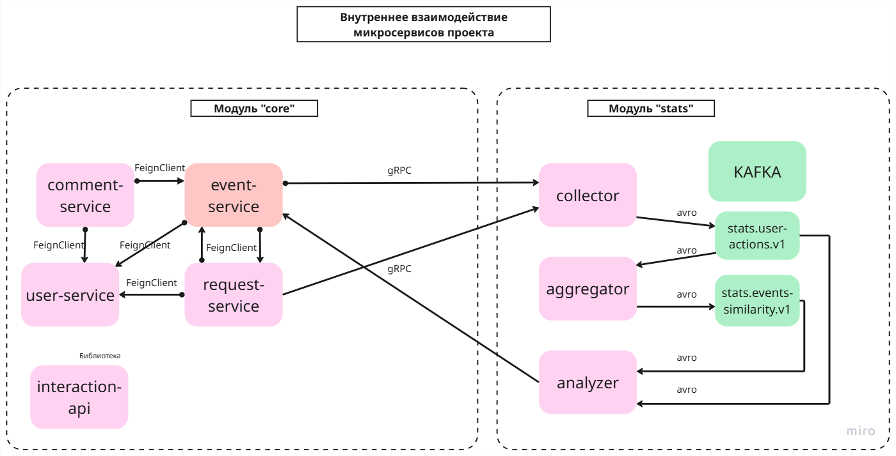

#  Java Plus Graduation Project

##  Описание
Это дипломный проект на Java, реализованный в архитектуре микросервисов с использованием Spring Boot, Spring Cloud и Docker.  
Приложение обеспечивает управление событиями, пользователями, комментариями, заявками и сбором статистики.

Задание, выполненное в рамках дипломного проекта, основывается на групповом проекте, участницей которого я была. 
Ссылка на проект, находящийся в основе данного дипломного проекта:
https://github.com/Maxim2777/java-explore-with-me-plus

Участники группового проекта:

https://github.com/Maxim2777

https://github.com/Akmula

https://github.com/griatva

https://github.com/ChakNikolay87

### Внесенные изменения:

**Этап 1:** 

Проект адаптирован для работы в облачной среде. 
Настроены следующие компоненты Spring Cloud:

* Spring Cloud Config Server
* Spring Cloud Eureka
* Spring Cloud Gateway

Настроен StatClient для работы в Eureka через:
DiscoveryClient и RetryTemplate.

**Этап 2:**

Разбиение монолитного сервиса main-service на микросервисы:
* event-service
* request-service
* user-service
* comment-service
* отдельно выделена библиотека **interaction-api**, где собраны общие классы DTO, exception, feign-client, fallback и пр.

Настройка межсервисной коммуникации с помощью:
Spring Cloud OpenFeign, 
Spring Cloud Circuit Breaker

**Этап 3:**

Рекомендательная система (Collector • Aggregator • Analyzer)

Микросервисная конвейерная обработка данных в реальном времени с использованием Apache Kafka и gRPC:
Состоит из следующих сервисов: 
* Collector
* Aggregator
* Analyzer

Каждый сервис:
* подхватывает конфигурацию из службы обнаружения
* запускается на случайном gRPC-порту
* использует Docker Compose для развертывания Kafka.

---

##  Архитектура

Проект состоит из следующих сервисов:

- **discovery-server**  
  Сервис регистрации (Eureka). Обеспечивает динамическое обнаружение микросервисов.

- **config-server**  
  Централизованное хранилище конфигураций. Все сервисы получают настройки отсюда.

- **gateway**  
  API Gateway. Все внешние запросы проходят через него. Выполняет маршрутизацию и базовую авторизацию.

- **event-service**  
  Сервис для работы с событиями. Использует базу данных `event-db`.

- **comment-service**  
  Сервис для управления комментариями к событиям. Использует базу данных `comment-db`.

- **request-service**  
  Сервис заявок пользователей на участие в событиях. Использует базу данных `request-db`.

- **stats-server**  
  Сервис сбора статистики посещений и просмотров. Использует базу данных `stats-db`.

- **user-service**  
  Сервис управления пользователями. Использует базу данных `user-db`.

- **Collector**  
  • gRPC-сервис для приёма действий пользователя (просмотр, регистрация, лайк)  
  • Публикует Avro-сообщения в топик `stats.user-actions.v1`

- **Aggregator**  
  • Читает `stats.user-actions.v1`  
  • Поддерживает матрицу весов пользователей–событий и частные суммы Sₘᵢₙ, Sₐ, S_b
  • Инкрементально вычисляет косинусное сходство событий  
  • Публикует результаты в топик `stats.events-similarity.v1` в формате Avro

- **Analyzer**  
  • Читает оба топика:  
    – `stats.user-actions.v1` (для сохранения максимальных весов действий)  
    – `stats.events-similarity.v1` (для сохранения коэффициентов сходства)  
  • Предоставляет gRPC-методы:  
    – `GetSimilarEvents(eventId, userId, maxResults)` — N наиболее похожих событий, с которыми пользователь ещё не взаимодействовал  
    – `GetRecommendationsForUser(userId, maxResults)` — персонализированные рекомендации на основе недавней истории и сходства  
    – `GetInteractionsCount(eventIds)` — суммарные веса взаимодействий по списку событий

### Взаимодействие сервисов

- Все сервисы регистрируются в **discovery-server**.
- Конфигурации загружаются через **config-server**.
- Внешние запросы приходят в **gateway**, который перенаправляет их к нужному сервису.
- Для внутреннего взаимодействия сервисы используют **Feign-клиентов**, gRPC и Kafka

---

### Docker Compose
Файл docker-compose.yml поднимает:
* 5 баз данных PostgreSQL (по одной базе данных на каждый сервис);
* Kafka

---

## Внутренний API

Схема внутреннего взаимодействия микросервисов проекта:

* **Event Service** (создан отдельный контроллер для внутренних эндпоинтов - InternalEventController):
  - `GET /internal/events/{id}` - получение события по его id (для CommentService и RequestService)
     Возвращаемое значение = EventFullDto
  

* **User Service** (используются эндпоинты из внешнего API):
  - `GET /admin/users` - получение списка юзеров по их id (для Event Service)
    Возвращаемое значение = List<UserDto>
  - `GET /admin/users/{userId}` - получение одного юзера по его id (для EventService, CommentService и RequestService)
    Возвращаемое значение = UserShortDto
  

* **Stats Server** (тут все эндпоинты сервиса для внутреннего использования):
  - `POST /hit` - сохранение статистики (для EventService)
    Возвращаемое значение = void
  - `GET /stats` - получение статистики (для EventService)
    Возвращаемое значение = List<ViewStatsDto>

* **Participation Request Service** (создан отдельный контроллер для внутренних эндпоинтов - InternalRequestController):
  - `GET /internal/events/requests/byEventId` - получение всех заявок на участие в событии по его id (для EventService)
    Возвращаемое значение = List<ParticipationRequestDto>
  - `GET /internal/events/requests/byEventIdsAndStatus` - получение списка заявок на участие в нескольких событиях по id этих 
     событий и с фильтрацией по статусу заявки (для EventService)
    Возвращаемое значение = List<ParticipationRequestDto>
  - `GET /internal/events/requests/count` - получение количества заявок с определенным статусом 
     для конкретного события по его id (для EventService)
    Возвращаемое значение = long
  - `PUT /internal/events/requests` - обновление информации о заявках на участие, например, статуса (для EventService)
    Возвращаемое значение = Integer

---

## API рекомендательных сервисов

### Collector Service
(gRPC-сервер для приёма пользовательских действий)
- **RPC** `CollectUserAction(UserActionProto) returns (google.protobuf.Empty)`
  - **UserActionProto**:
    - `int64 user_id`
    - `int64 event_id`
    - `ActionTypeProto action_type`  (_VIEW, REGISTER, LIKE_)
    - `google.protobuf.Timestamp timestamp`
  - публикует Avro-сообщение `UserActionAvro` в топик `stats.user-actions.v1`

---

### Aggregator Service
(взаимодействует исключительно через Kafka; внешних HTTP/gRPC-эндпоинтов нет)
- потребляет `stats.user-actions.v1`
- инкрементально вычисляет сходства и публикует Avro `EventSimilarityAvro` в `stats.events-similarity.v1`

---

### Analyzer Service
(gRPC-сервер для выдачи рекомендаций)
- **RPC** `GetSimilarEvents(SimilarEventsRequestProto) returns (stream RecommendedEventProto)`
  - **SimilarEventsRequestProto**:
    - `int64 event_id`
    - `int64 user_id`
    - `int32 max_results`
  - возвращает N похожих событий, с которыми пользователь ещё не взаимодействовал
- **RPC** `GetRecommendationsForUser(UserPredictionsRequestProto) returns (stream RecommendedEventProto)`
  - **UserPredictionsRequestProto**:
    - `int64 user_id`
    - `int32 max_results`
  - возвращает N персональных рекомендаций на основе истории и сходства
- **RPC** `GetInteractionsCount(InteractionsCountRequestProto) returns (stream RecommendedEventProto)`
  - **InteractionsCountRequestProto**:
    - `repeated int64 event_id`
  - возвращает для каждого event_id сумму весов всех взаимодействий
- **RecommendedEventProto**:
  - `int64 event_id`
  - `double score`

#### Feign-клиенты:

* **EventClient** - используется в CommentService и RequestService для проверки наличия события с базе и получения его по его id.
* **UserClient** - используется в EventService, CommentService и RequestService для получения информации об одном или нескольких юзерах.
* **StatsClient** - используется в EventService для сохранения и получения статистики.
* **ParticipationRequestClient** - используется в EventService для получения информации и заявках для одного или нескольких событий,
  а также для подсчета согласованных заявок и обновлении статуса заявок. 
---

#### gRPC-клиенты

* **CollectorClient** — в EventService и RequestService отправляет действия пользователя (`view`, `like`, `register`) в Collector Service по методу `CollectUserAction(UserActionProto)`.
* **RecommendationsClient** — в EventService запрашивает у Analyzer Service:
  - совокупный вес взаимодействий (`GetInteractionsCount`),
  - похожие события (`GetSimilarEvents`),
  - персональные рекомендации (`GetRecommendationsForUser`).

---

#### Kafka-топики

1. **stats.user-actions.v1**
  - Producer: Collector Service (Avro `UserActionAvro`)
  - Consumers:
    - Aggregator Service (для вычисления сходства событий)
    - Analyzer Service (для обновления истории взаимодействий)

2. **stats.events-similarity.v1**
  - Producer: Aggregator Service (Avro `EventSimilarityAvro`)
  - Consumer: Analyzer Service (для сохранения коэффициентов сходства)

#### Fallback‑механизм:

Для повышения отказоустойчивости используется **Spring Cloud Circuit Breaker** (Resilience4j) совместно с **Feign‑клиентами**.

Реализация:
- Для каждого Feign‑клиента создан fallback‑класс.
- При ошибке вызова Feign автоматически вызывает fallback‑метод.
- Используется параметр `fallback` в аннотации `@FeignClient`.

---

### Внешний API
Для сервера рекомендаций (тестер):
https://github.com/yandex-praktikum/java-plus-graduation/blob/ci/Readme.md

Для основной функциональности (postman):
https://github.com/yandex-praktikum/java-plus-graduation/blob/ci/.github/workflows/stuff/postman/recommendations/ewm-main-service.json

---

