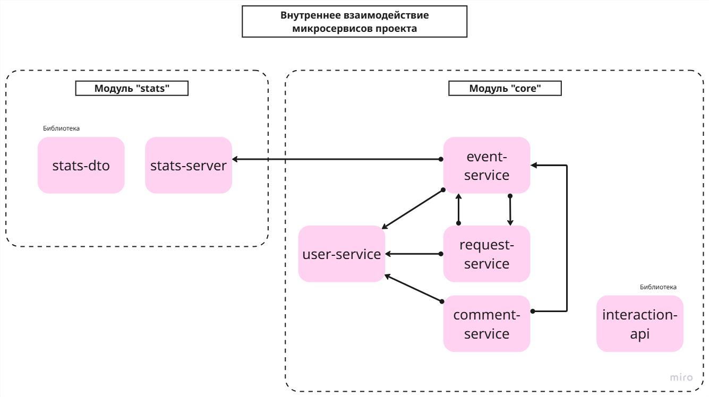

#  Java Plus Graduation Project

##  Описание
Это дипломный проект на Java, реализованный в архитектуре микросервисов с использованием Spring Boot, Spring Cloud и Docker.  
Приложение обеспечивает управление событиями, пользователями, комментариями, заявками и сбором статистики.

Задание, выполненное в рамках дипломного проекта, основывается на групповом проекте, участницей которого я была. 
Ссылка на проект, находящийся в основе данного дипломного проекта:
https://github.com/Maxim2777/java-explore-with-me-plus

Участники группового проекта:

https://github.com/Maxim2777

https://github.com/Akmula

https://github.com/griatva

https://github.com/ChakNikolay87

### Внесенные изменения:

**Этап 1:** 

Проект адаптирован для работы в облачной среде. 
Настроены следующие компоненты Spring Cloud:

* Spring Cloud Config Server
* Spring Cloud Eureka
* Spring Cloud Gateway

Настроен StatClient для работы в Eureka через:
DiscoveryClient и RetryTemplate.

**Этап 2:**

Разбиение монолитного сервиса main-service на микросервисы:
* event-service
* request-service
* user-service
* comment-service
* отдельно выделена библиотека **interaction-api**, где собраны общие классы DTO, exception, feign-client, fallback и пр.

Настройка межсервисной коммуникации с помощью:
Spring Cloud OpenFeign, 
Spring Cloud Circuit Breaker

---

##  Архитектура

Проект состоит из следующих сервисов:

- **discovery-server**  
  Сервис регистрации (Eureka). Обеспечивает динамическое обнаружение микросервисов.

- **config-server**  
  Централизованное хранилище конфигураций. Все сервисы получают настройки отсюда.

- **gateway**  
  API Gateway. Все внешние запросы проходят через него. Выполняет маршрутизацию и базовую авторизацию.

- **event-service**  
  Сервис для работы с событиями. Использует базу данных `event-db`.

- **comment-service**  
  Сервис для управления комментариями к событиям. Использует базу данных `comment-db`.

- **request-service**  
  Сервис заявок пользователей на участие в событиях. Использует базу данных `request-db`.

- **stats-server**  
  Сервис сбора статистики посещений и просмотров. Использует базу данных `stats-db`.

- **user-service**  
  Сервис управления пользователями. Использует базу данных `user-db`.

### Взаимодействие сервисов

- Все сервисы регистрируются в **discovery-server**.
- Конфигурации загружаются через **config-server**.
- Внешние запросы приходят в **gateway**, который перенаправляет их к нужному сервису.
- Для внутреннего взаимодействия сервисы используют **Feign-клиентов** и Eureka.
- Каждому сервису соответствует отдельная PostgreSQL база данных.

---

### Docker Compose
Файл docker-compose.yml поднимает:
5 сервисов PostgreSQL (по одной базе данных на каждый сервис);

---

## Внутренний API

Схема внутреннего взаимодействия микросервисов проекта:

* **Event Service** (создан отдельный контроллер для внутренних эндпоинтов - InternalEventController):
  - `GET /internal/events/{id}` - получение события по его id (для CommentService и RequestService)
     Возвращаемое значение = EventFullDto
  

* **User Service** (используются эндпоинты из внешнего API):
  - `GET /admin/users` - получение списка юзеров по их id (для Event Service)
    Возвращаемое значение = List<UserDto>
  - `GET /admin/users/{userId}` - получение одного юзера по его id (для EventService, CommentService и RequestService)
    Возвращаемое значение = UserShortDto
  

* **Stats Server** (тут все эндпоинты сервиса для внутреннего использования):
  - `POST /hit` - сохранение статистики (для EventService)
    Возвращаемое значение = void
  - `GET /stats` - получение статистики (для EventService)
    Возвращаемое значение = List<ViewStatsDto>

* **Participation Request Service** (создан отдельный контроллер для внутренних эндпоинтов - InternalRequestController):
  - `GET /internal/events/requests/byEventId` - получение всех заявок на участие в событии по его id (для EventService)
    Возвращаемое значение = List<ParticipationRequestDto>
  - `GET /internal/events/requests/byEventIdsAndStatus` - получение списка заявок на участие в нескольких событиях по id этих 
     событий и с фильтрацией по статусу заявки (для EventService)
    Возвращаемое значение = List<ParticipationRequestDto>
  - `GET /internal/events/requests/count` - получение количества заявок с определенным статусом 
     для конкретного события по его id (для EventService)
    Возвращаемое значение = long
  - `PUT /internal/events/requests` - обновление информации о заявках на участие, например, статуса (для EventService)
    Возвращаемое значение = Integer

#### Feign-клиенты:

* **EventClient** - используется в CommentService и RequestService для проверки наличия события с базе и получения его по его id.
* **UserClient** - используется в EventService, CommentService и RequestService для получения информации об одном или нескольких юзерах.
* **StatsClient** - используется в EventService для сохранения и получения статистики.
* **ParticipationRequestClient** - используется в EventService для получения информации и заявках для одного или нескольких событий,
  а также для подсчета согласованных заявок и обновлении статуса заявок. 

#### Fallback‑механизм:

Для повышения отказоустойчивости используется **Spring Cloud Circuit Breaker** (Resilience4j) совместно с **Feign‑клиентами**.

Реализация:
- Для каждого Feign‑клиента создан fallback‑класс.
- При ошибке вызова Feign автоматически вызывает fallback‑метод.
- Используется параметр `fallback` в аннотации `@FeignClient`.

---

### Внешний API
Для сервера статистики:
https://raw.githubusercontent.com/yandex-praktikum/java-explore-with-me/main/ewm-stats-service-spec.json

Для основной функциональности:
https://raw.githubusercontent.com/yandex-praktikum/java-explore-with-me/main/ewm-main-service-spec.json

---

